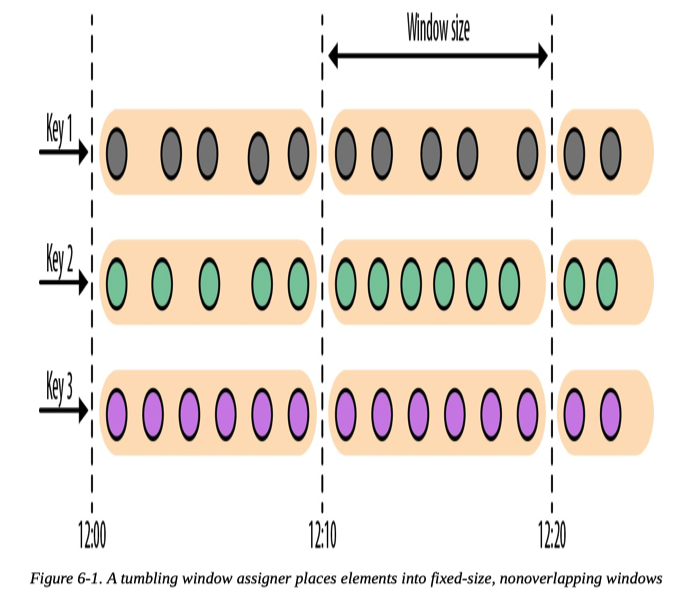

- [Overview](#overview)
  - [Compare](#compare)
  - [Dataflow Graph](#dataflow-graph)
  - [Window](#window)
- [Architecture of Flink](#architecture-of-flink)
  - [Dispatcher](#dispatcher)
  - [JobManager](#jobmanager)
  - [Resource Manager](#resource-manager)
  - [Task Manager](#task-manager)
- [Time Semantics](#time-semantics)
  - [Processing Time and Event Time](#processing-time-and-event-time)
  - [Timestamp](#timestamp)
  - [Watermarks](#watermarks)
  - [Watermark Propagation and Event Time](#watermark-propagation-and-event-time)
  - [Late Data](#late-data)
- [State](#state)
  - [Operator State](#operator-state)
  - [Keyed State](#keyed-state)
  - [State Backends](#state-backends)
- [Tasks in Detail](#tasks-in-detail)
  - [Data Transfer Between Tasks](#data-transfer-between-tasks)
  - [Credit-Based Flow Control](#credit-based-flow-control)
- [Application Deployment](#application-deployment)
  - [Framework style - Traditional Way](#framework-style---traditional-way)
  - [Library style - for Microservices Architectures](#library-style---for-microservices-architectures)
- [Other Tips](#other-tips)
  - [Isolation vs Performance](#isolation-vs-performance)
  - [Execution Mode](#execution-mode)

# Overview
## Compare 
Before the rise of modern stream processors, a common approach to process unbounded data was to repeatedly schedule jobs over **small batches** of incoming events on a batch processing system. When a job finishes, the result is written to persistent storage, and all operator state is lost. Once a job is scheduled for execution on the next batch, it cannot access the state of the previous job. This problem is commonly solved by delegating state management to an external system, such as a database. In contrast, in continuously running streaming jobs, state is durable across events and we can expose it as a first-class citizen in the programming model.  

## Dataflow Graph
Dataflow graph is represented as a directed graph. The operators without input ports is called ```Data source```; the operators without output ports is called ```Data sink```.

In a logical graph, nodes represents operators; in a physical graph, nodes are tasks. Logical graph is converted to physical graph by a JobManager.

## Window
The ```Window``` operations continuously create **finite** sets of events called ```buckets``` from an unbounded event stream and let us perform computations on these finite sets. There are three types of window:
1. ```Tumbling```: assign events into **non-overlapping** buckets of fixed length/time interval
  
2. Sliding: windows assign events into **overlapping** buckets of fixed size. The slide value defines the interval at which a new bucket is created
  

3. Session: Session windows group events in sessions based on a session gap value that defines the time of inactivity to consider a session closed.
    

# Architecture of Flink
When a ```TaskManager``` has been started, it registers its slots to the ```ResourceManager```. Afterwards when an application is submitted for execution, TaskManager was instructed by the ResourceManager to offer one or more of its slots to a ```JobManager```. The JobManager can then assign tasks to the slots to execute them. During execution, a TaskManager exchanges data with other TaskManagers that run tasks of the same application.


## Dispatcher
Dispatcher provides a **REST interface** to submit applications for execution. Once an application is submitted for execution, it starts a JobManager and hands the application over. A dispatcher might not be required in some cases, but the REST interface enables the dispatcher to serve as an HTTP entry point to clusters that are behind a firewall.

## JobManager
Each application is controlled by a different JobManager process, which 
* Converts the logical JobGraph into the physical ExecutionGraph
* Requests TaskManager slots from ResourceManager
* Distribute the tasks of the ExecutionGraph to the TaskManagers once it receives enough TaskManager slots
* Responsible for coordination during execution

## Resource Manager
The ResourceManager is responsible for managing **TaskManager slots**, Flink’s unit of processing resources: 
 * Instructs a TaskManager with idle slots to offer them to the JobManager, when a JobManager requests TaskManager slots 
 * Talk to a resource provider to provision containers when there are not enough slots
 * Terminate idle TaskManagers to free resources

Flink features multiple ResourceManagers for different environments and resource providers such as YARN, Mesos, Kubernetes, and standalone deployments. 

## Task Manager
TaskManagers are the **worker processes** of Flink. Typically, there are multiple TaskManagers running in a Flink setup. Each TaskManager provides a certain number of slots, which limits the number of tasks a TaskManager can execute. 

A processing slot can execute one slice of an application—one parallel task of each operator of the application.

# Time Semantics
## Processing Time and Event Time
Definition: 
* Processing Time: the time of the local clock on the machine where the operator processing **the stream is being executed**
* Event time: the time when an event in the stream **actually happened**, based on a **timestamp**

Pros and Cons:
* Processing time: offers low latency but results depend on the speed of processing and are not deterministic
* event time guarantees deterministic results and allows you to deal with events that are late or even **out-of-order** messages.

## Timestamp
Flink encodes Event time timestamps as 16-byte **Long** values and attaches them as metadata to records. Its built-in operators interpret the Long value as a **Unix timestamp with millisecond precision**. Timestamps and watermarks are usually assigned and generated when a stream is **ingested** by a streaming application. 

User-defined timestamp assignment functions should be applied **as close to a source operator as possible** because it can be difficult to reason about the order of records and their timestamps after they have been processed by an operator. This is also the reason it is not a good idea to override existing timestamps and watermarks in the middle of a streaming application.

<!-- A Flink DataStream application can assign timestamps in three ways:

* **At the source**: Timestamps and watermarks can be assigned and generated by a SourceFunction when a stream is ingested into an application. A source function emits a stream of records. Records can be emitted together with an associated timestamp, and watermarks can be emitted at any point in time as special records. If a source function (temporarily) does not emit anymore watermarks, it can declare itself idle. Flink will exclude stream partitions produced by idle source functions from the watermark computation of subsequent operators. The idle mechanism of sources can be used to address the problem of not advancing watermarks as discussed earlier. Source functions are discussed in more detail in “Implementing a Custom Source Function”.

* Periodic assigner: The DataStream API provides a user-defined function called AssignerWithPeriodicWatermarks that extracts a timestamp from each record and is periodically queried for the current watermark. The extracted timestamps are assigned to the respective record and the queried watermarks are ingested into the stream. This function will be discussed in “Assigning Timestamps and Generating Watermarks”.

* Punctuated assigner: AssignerWithPunctuatedWatermarks is another user-defined function that extracts a timestamp from each record. It can be used to generate watermarks that are encoded in special input records. In contrast to the AssignerWithPeriodicWatermarks function, this function can—but does not need to—extract a watermark from each record. We discuss this function in detail in “Assigning Timestamps and Generating Watermarks” as well. -->

## Watermarks
Considering delayed or out-of-order messages, further events with timestamp less than T may be received at time T, then we can never decide when to trigger an event time window. This is why we need watermarks.

Watermarks are used to derive the **current event time** at each task in an event-time application and it has two properties:
* Must be monotonically increasing 
* A water mark with a timestamp T indicates that all subsequent records should have timestamps > T

Watermark is implemented as special records holding timestamp as a Long value and can be access only via DataStream API. Time-based operators use this time to trigger computations and make progress. 

Watermark can be used to control completeness and latency. Tight watermark -> low latency + low completeness; conservative watermark -> high latency + high completeness. 

## Watermark Propagation and Event Time
**A task maintains a partition watermark for each input partition.** When a task's partition receives a watermark:
1. The task updates its partition's internal event-time clock to be the maximum of the received watermark value and the current value
2. The task updates its event-time clock to be the minimum of all partition watermarks. 
3. If the event-time clock advances, the task processes all triggered timers and invokes a callback function that can perform a computation and emit records.
4. The task broadcasts its new event time to all downstream tasks by emitting a corresponding watermark to all connected output partitions.

The tasks of operators with two or more input streams such as Union or CoFlatMap compute their event-time clock as the minimum of all partition watermarks. 

An example is as follow:   


## Late Data
Definition: When a task receives a record that violates the watermark property and has smaller timestamps than a previous received watermark, it may be that the computation it belongs to has already been completed

Flink provides different ways to deal with late records:
* TODO

# State
All data maintained by a task and used to compute the results of a function belong to the state of the task. You can think of state as a local or instance variable that is accessed by a task’s business logic. 

In Flink, state is always associated with a specific operator. 

Because efficient state access is crucial to processing records with low latency, each parallel task **locally maintains its state** to ensure fast state accesses. 

## Operator State    
The ```Operator state``` is scoped to an operator task. This means that every task of the same or different operator has different states. Flink offers three primitives for operator state:
* **List state**: Represents state as a list of entries.
* **Union list state**: it differs from regular list state in how it is restored in the case of a failure or when an application is started from a savepoint.
* **Broadcast state**: Designed for the special case where the state of each task of an operator is identical


When scaling:
 * List state: redistributing the list entries to tasks
 * Union list state: broadcasting the full list of state entries to each task. The task can then choose which entries to use and which to discard.
 * Broadcast state: copying the state to new tasks

Scaling list state and broadcast state is trivial. Below is the image for scaling the union list state:


## Keyed State
The ```Keyed state``` is maintained and accessed with respect to a key defined in the records of an operator’s input stream, which is similar to as a key-value map that is partitioned on the key across all parallel tasks of an operator. The primitives are:
* **Value state**: Stores a single value of arbitrary type per key.
* **List state**: Stores a list of values per key.
* **Map state**: Stores a key-value map per key. 


Operators with keyed state are scaled by re-partitioning keys to fewer or more tasks. Flink does not redistribute individual keys. Instead, Flink organizes keys in ```key groups```: a partition of keys. Key group can belong to different tasks when scaling.


## State Backends
How exactly the state is stored, accessed, and maintained is determined by a component called a ```state backend```, which is responsible for two things:
* local state management: stores all keyed states and ensures that all accesses are correctly scoped to the current key. 
* checkpoint state to a remote location
A state backend is responsible for two things: local state 

Flink provides two options for backends: 
* backends that manage keyed state as objects stored in in-memory data structures on the **JVM heap**, which is fast but limited by the size of memory
* backend serializes state objects and puts them into **RocksDB** on hard disk, which is slower but scalable

# Tasks in Detail
## Data Transfer Between Tasks
Flink has 4 data exchange strategies:
* Forward: sends data from a task to a receiving task
* Broadcast: sends every data item to all parallel tasks
* Key-based: data items having the same key will be processed by the same task
* Random: uniformly distributes data items to operator tasks


Shipping data from sending tasks to receiving tasks is taken care of by the **TaskManagers** in a pipelined fashion: each sending task maintains a dedicated and permanent **TCP** connection for each receiving task to exchange data. A TaskManager must be able to provide enough buffers to serve all outgoing and incoming connections concurrently to enable a smooth pipelined data exchange, . Flink’s default configuration for network buffers is sufficient for small-to-medium-sized setups.

## Credit-Based Flow Control
Sending individual records over a network connection is inefficient and causes significant overhead. Buffering is needed to fully utilize the bandwidth of network connections. In the context of stream processing, one disadvantage of buffering is that it adds latency because records are collected in a buffer instead of being immediately shipped.

Flink implements a ```credit-based flow control mechanism``` that works as follows:
1. A receiving task grants some credit to a sending task, which is the number of network buffers that are reserved to receive its data
2. Once a sender receives a credit notification, it ships as many buffers as it was granted and the size of its backlog: the number of network buffers that are filled and ready to be shipped. 
3. The receiver processes the shipped data with the reserved buffers and uses the sender’s backlog size to prioritize the next credit grants for all its connected senders.

Credit-based flow control reduces latency because senders can ship data as soon as the receiver has enough resources to accept it. Moreover, it is an effective mechanism to distribute network resources in the case of skewed data distributions because credit is granted based on the size of the senders’ backlog. Hence, credit-based flow control is an important building block for Flink to achieve high throughput and low latency.

# Application Deployment
Flink Application can be deployed in two different styles.

## Framework style - Traditional Way
Flink applications are packaged into a **JAR file** and submitted by a client to **a running service**. The service can be a Flink Dispatcher, a Flink JobManager, or YARN’s ResourceManager, but finally handed to a Flink JobManager to be executed.

## Library style - for Microservices Architectures
In this mode, the Flink application is bundled in an application- specific container and a job-independent container.

* Application-specific container: container that launches the ResourceManager and JobManager and submits the bundled job for execution. 

* TaskManager container: container that starts a TaskManager, which connects to the ResourceManager and registers its slots.

# Other Tips
## Isolation vs Performance
A TaskManager executes its tasks multi-threaded in the same JVM process. Threads are more lightweight than separate processes and have lower communication costs but do not strictly isolate tasks from each other. By configuring only a single slot per TaskManager, you can isolate applications across TaskManagers. By leveraging thread parallelism inside a TaskManager and deploying several TaskManager processes per host, Flink offers a lot of flexibility to trade off performance and resource isolation when deploying applications.

## Execution Mode
A Flink application is submitted to the JobManager (master), which distributes execution tasks to one or more TaskManagers (workers). Since Flink is a distributed system, the JobManager and TaskManagers typically run as separate JVM processes on different machines. Usually, the program’s main() method assembles the dataflow and submits it to a remote JobManager when the StreamExecutionEnvironment.execute() method is called.

However, there is also a mode in which the call of the execute() method starts a JobManager and a TaskManager (by default with as many slots as available CPU threads) as separate threads within the same JVM. Consequently, the whole Flink application is multi-threaded and executed within the same JVM process.

