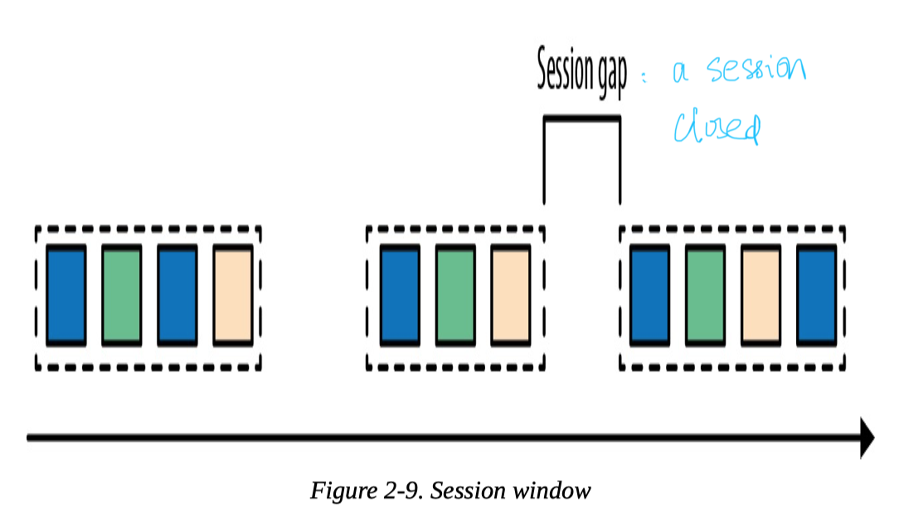

- [Time-Based and Window Operations](#time-based-and-window-operations)
  - [Overview](#overview)
  - [LifeCycle](#lifecycle)
- [Window Assigner](#window-assigner)
  - [Build-in Window Assigner](#build-in-window-assigner)
    - [Tumbling Window](#tumbling-window)
    - [Sliding Window](#sliding-window)
    - [Session Window](#session-window)
  - [Custom Window Assigner](#custom-window-assigner)
- [Trigger](#trigger)
- [Evictor](#evictor)
- [Window Operation](#window-operation)
- [Handle Late Data](#handle-late-data)

# Time-Based and Window Operations 
## Overview
Window operations enable transformations on bounded intervals of an unbounded stream. Elements are assigned to windows by a **WindowAssigner**, a **trigger** decides when to evaluate a window, and a **window function** performs the actual window evaluation.

The sketch code and a figure are as follow:  
```scala
stream 
    .keyBy(...)
    .window(...) // specify the window assigner 
    [.trigger(...)] // optional: specify the trigger 
    [.evictor(...)] // optional: specify the evictor
    .reduce/aggregate/process(...) // specify the window function
```


1. Specify the ```Window Assigner```  
 When an element arrives at a window operator, it is handed to the WindowAssigner. The assigner determines to **which windows the element needs to be routed**. If a window does not exist yet, it is created. If the window operator is configured with an incremental aggregation function, such as a ReduceFunction or AggregateFunction, the newly added element is immediately aggregated and the result is stored as the contents of the window. If the window operator does not have an incremental aggregation function, the new element is appended to a ListState that holds all assigned elements.

2. Specify the ```Trigger```  
 Each WindowAssigner has a **default** trigger that is used. However, we can use ```trigger()``` to define an explicit trigger. Every time an element is added to a window, it is also passed to the trigger of the window. The trigger **defines (fires) when a window is considered ready for evaluation and when a window is purged and its contents are cleared.** A trigger can decide based on assigned elements or registered timers (similar to a process function) to evaluate or purge the contents of its window at specific points in time.

3. Specify the ```evictor```  
 The evictor is an optional component that can be injected before or after a ProcessWindowFunction is called. An evictor can **remove collected elements from the contents of a window**. Since it has to iterate over all elements, it can only be used if no incremental aggregation function is specified.

4. Specify the ```Window Operator```
 What happens when a trigger fires depends on the configured functions of the window operator.

## LifeCycle
A window is created when the WindowAssigner assigns the first element to it. Consequently, there is no window without at least one element. A window consists of different pieces of state as follows:

* Window content  
  The window content holds the elements that have been assigned to the window or the result of the incremental aggregation in case the window operator has a ReduceFunction or AggregateFunction.

* Window object  
  The WindowAssigner returns zero, one, or multiple window objects. The window operator groups elements based on the returned objects. Hence, a window object holds the information used to distinguish windows from each other. Each window object has an end timestamp that defines the point in time after which the window and its state can be deleted.

* Timers of a trigger  
  A trigger can register timers to be called back at certain points in time. These timers are maintained by the window operator.

* Custom-defined state in a trigger  
  A trigger can define and use custom, per-window and per-key state. This state is completely controlled by the trigger and not maintained by the window operator.

The window operator deletes a window when the end time of the window is reached. When a window is deleted, the window operator automatically clears the window content and discards the window object. Custom-defined trigger state and registered trigger timers are not cleared because this state is opaque to the window operator. Hence, a trigger must clear all of its state in the Trigger.clear() method to prevent leaking state.

# Window Assigner
## Build-in Window Assigner
The ```Window``` operations continuously create **finite** sets of events called ```buckets``` from an unbounded event stream and let us perform computations on these finite sets. All built-in window assigners provide a default **trigger** that triggers the evaluation of a window once the time passes the end of the window. A window is created when the first element is assigned to it, Flink will never evaluate empty windows.

Flink’s built-in window assigners create windows of type ```TimeWindow```. This window type essentially represents a time interval between the two timestamps, where start is inclusive and end is exclusive. It exposes methods to retrieve the window boundaries, to check whether windows intersect, and to merge overlapping windows.

### Tumbling Window 
Tumbling Window assigns events into **non-overlapping** buckets of fixed length/time interval. ```TumblingEventTimeWindows``` and ```TumblingProcessingTimeWindows``` are for event time and processing time windows respectively. By default, tumbling windows are **aligned** to the epoch time, 1970-0101-00:00:00.000. 

The API and the figure are as follow:

```scala
val avgTemp = data
    .keyBy(_.id) 
    .window(TumblingEventTimeWindows.of(Time.seconds(1))) 
    .process(...)

// Specify the offset explicitly
val avgTemp = data
    .keyBy(_.id) 
    .window(TumblingEventTimeWindows.of(Time.hours(1), Time.minutes(15))) 
    .process(...)

// shortcut
val avgTemp = data
    .keyBy(_.id)
    .timeWindow(Time.seconds(1))
    .process(...)
```
  

  
### Sliding Window  
For a sliding window, you have to specify a window size and a **slide interval**. The slide value defines the interval at which a new bucket is created.

When the slide interval is smaller than the window size, the windows overlap and elements can be assigned to more than one window. If the slide is larger than the window size, some elements might not be assigned to any window and hence may be dropped.

The API and the figure are as follow:
  
```scala

 val slidingAvgTemp = sensorData 
   .keyBy(_.id) 
   .window(SlidingEventTimeWindows.of(Time.hours(1), Time.minutes(15))) 
   .process()

//  shortcut  
val slidingAvgTemp = sensorData 
    .keyBy(_.id)
    .timeWindow(Time.hours(1), Time(minutes(15))) 
    .process()
```


### Session Window  
Session windows group events in sessions based on a session gap value that defines the time of inactivity to consider a session closed.
   
The API and the figure are as follow:

```scala
// event-time session windows assigner 
val sessionWindows = sensorData
    .keyBy(_.id)
    .window(EventTimeSessionWindows.withGap(Time.minutes(15))) 
    .process(...)
```

 
    
## Custom Window Assigner
A WindowAssigner determines for each arriving element to which windows it is assigned. It also needs to provide a default trigger that is used if no explicit trigger is specified.

The interface is as follow:
```scala
public abstract class WindowAssigner<T, W extends Window> implements Serializable {

    // Returns a collection of windows to which the element is assigned
    public abstract Collection<W> assignWindows( 
        T element, 
        long timestamp, 
        WindowAssignerContext context);

    // Returns the default Trigger of the WindowAssigner public abstract 
    Trigger<T, W> getDefaultTrigger( StreamExecutionEnvironment env);

    // Returns the TypeSerializer for the windows of this WindowAssigner 
    public abstract TypeSerializer<W> getWindowSerializer( ExecutionConfig executionConfig);

    // Indicates whether this assigner creates event-time windows 
    public abstract boolean isEventTime(); 
    
    // A context that gives access to the current processing time 
    public abstract static class WindowAssignerContext {
        // Returns the current processing time 
        public abstract long getCurrentProcessingTime();
    }
}
```

# Trigger
Triggers define when a window is evaluated and its results are emitted. Each WindowAssigner has a default trigger that is used. However, we can use ```trigger()``` to define an explicit trigger. Triggers have access to time properties and timers, and can work with state, which make it possible to implement complex logic. 

Every time a trigger is called it produces a ```TriggerResult``` that determines what should happen to the window. TriggerResult can take one of the following values:
* ```CONTINUE```:  No action is taken.

* ```FIRE```: If the window operator has a ProcessWindowFunction, the function is called and the result is emitted. If the window only has an ReduceFunction or AggregateFunction, the current aggregation result is emitted. The state of the window is not changed. 

* ```PURGE```: The content of the window is completely discarded and the window including all metadata is removed. Also, the ProcessWindowFunction.clear() method is invoked to clean up all custom per-window state.

* ```FIRE_AND_PURGE```: Evaluates the window first (FIRE) and subsequently removes all state and metadata (PURGE).

The API is as follow:
```scala
public abstract class Trigger<T, W extends Window> implements Serializable {

  // Called for every element that gets added to a window 
  TriggerResult onElement( T element, long timestamp, W window, TriggerContext ctx);

  // Called when a processing-time timer fires public abstract 
  TriggerResult onProcessingTime( long timestamp, W window, TriggerContext ctx);

  // Called when an event-time timer fires public abstract TriggerResult 
  onEventTime( long timestamp, W window, TriggerContext ctx);

  // Returns true if this trigger supports merging of trigger state 
  public boolean canMerge();

  // Called when several windows have been merged into one window and the state of the triggers needs to be merged 
  public void onMerge(W window, OnMergeContext ctx);

  // Clears any state that the trigger might hold for the given window 
  // This method is called when a window is purged 
  public abstract void clear(W window, TriggerContext ctx); 
}

  // A context object that is given to Trigger methods to allow them  to register timer callbacks and deal with state 
public interface TriggerContext {

  // Returns the current processing time 
  long getCurrentProcessingTime();

  // Returns the current watermark time 
  long getCurrentWatermark();

  // Registers a processing-time timer 
  void registerProcessingTimeTimer(long time);

  // Registers an event-time timer 
  void registerEventTimeTimer(long time);

  // Deletes a processing-time timer 
  void deleteProcessingTimeTimer(long time);

  // Deletes an event-time timer 
  void deleteEventTimeTimer(long time);

  // Retrieves a state object that is scoped to the window and the key of the trigger
  <S extends State> S getPartitionedState(StateDescriptor<S, ?> stateDescriptor); }

  // Extension of TriggerContext that is given to the Trigger.onMerge() method 
  public interface OnMergeContext extends TriggerContext {
    // Merges per-window state of the trigger
    // The state to be merged must support merging
    void mergePartitionedState(StateDescriptor<S, ?> stateDescriptor); 
}
```

# Evictor
The Evictor is an optional component in Flink’s windowing mechanism. It can remove elements from a window before or after the window function is evaluated. It can only be applied if the window collects all added events and does not apply a ReduceFunction or AggregateFunction to incrementally aggregate the window content.

The API is as follow:
```scala
public interface Evictor<T, W extends Window> extends Serializable {
  // Optionally evicts elements. Called before windowing function. 
  void evictBefore(Iterable<TimestampedValue<T>> elements, int size, W window, EvictorContext evictorContext);

  // Optionally evicts elements. Called after windowing function. 
  void evictAfter(Iterable<TimestampedValue<T>> elements, int size, W window, EvictorContext evictorContext);

  // A context object that is given to Evictor methods. 
  interface EvictorContext {
    // Returns the current processing time. 
    long getCurrentProcessingTime();

    // Returns the current event time watermark. 
    long getCurrentWatermark();
}
```

# Window Operation
The ```ReduceFunction``` accepts two values of the **same type** and combines them into a single value of the **same type**.  A window only stores the current result of the aggregation. ```AggregateFunction``` is similar except that the input, intermediate data and the output can all be of **different types**. ```ProcessWindowFunction``` collects all elements of a window and iterate over the list of all collected elements when they are evaluated.

ProcessWindowFunction is very powerful, but not as efficient as ReduceFunction or AggregateFunction. If you have incremental aggregation logic but also need access to window metadata, you can **combine a ReduceFunction or AggregateFunction with a ProcessWindowFunction**. Elements that are assigned to a window will be immediately aggregated and when the trigger of the window fires, the aggregated result will be handed to ProcessWindowFunction. 

The code is as follow:
```scala
input
  .keyBy(...)
  .timeWindow(...)
  .reduce(incrAggregator: ReduceFunction[IN], function: ProcessWindowFunction[IN, OUT, K, W])

input
  .keyBy(...) 
  .timeWindow(...) 
  .aggregate(incrAggregator: AggregateFunction[IN, ACC, V], windowFunction: ProcessWindowFunction[V, OUT, K, W])
```

# Handle Late Data
A late element is an element that arrives at an operator when a computation to which it would need to contribute has already been performed. In the context of an event-time window operator, an event is late if it arrives at the operator and the window assigner maps it to a window that has already been computed because the operator’s watermark passed the end timestamp of the window.

The DataStream API provides different options for how to handle late events:
1. **Drop late event**  
  This is the Default behavior
2. **Redirected into a separate stream**  
  Late events can also be redirected into another DataStream using the side-output feature. From there, the late events can be processed or emitted using a regular sink function. Depending on the business requirements, late data can later be integrated into the results of the streaming application with a periodic backfill process.
3. **Update Computation results**  
  
There are a few issues that need to be taken into account in order to be able to recompute and update results.

* An operator that supports recomputing and updating of emitted results needs to preserve all state required for the computation after the first result was emitted

* The downstream operators or external systems that follow an operator, which updates previously emitted results, need to be able to handle these updates. 

The window operator API provides ```allowedLateness()``` method to explicitly declare that you expect late elements. When a late element arrives within the allowed lateness period it is handled like an on-time element and handed to the trigger. When the watermark passes the window’s end timestamp plus the lateness interval, the window is finally deleted and all subsequent late elements are discarded. The code is as below.

```scala
// process late readings for 5 additional seconds 
val countPer10Secs = readings
  .keyBy(_.id) 
  .timeWindow(Time.seconds(10)) 
  .allowedLateness(Time.seconds(5))
  .process(...)
```